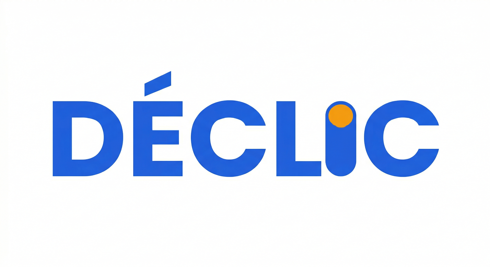

# DÉCLIC — Diagnostic IA par métier

<p align="center">
  
</p>

<p align="center">
  <strong>Identifiez ce que l'IA peut automatiser dans votre quotidien professionnel.</strong>
</p>

<p align="center">
  <a href="#fonctionnalités">Fonctionnalités</a> •
  <a href="#stack-technique">Stack</a> •
  <a href="#installation">Installation</a> •
  <a href="#méthodologie-déclic">Méthodologie</a> •
  <a href="#licence">Licence</a>
</p>

---

## Fonctionnalités

**Diagnostic Express** — Entrez votre métier, obtenez en 30 secondes la liste de vos tâches automatisables, le temps récupérable, et un plan d'action. Base de 15 métiers pré-analysés, gratuit, sans configuration.

**Diagnostic Personnalisé** — Formulaire guidé basé sur la méthode DÉCLIC : décrivez votre quotidien, vos outils, vos contraintes. L'IA génère un diagnostic sur-mesure avec avant/après, étapes de mise en place, et estimation de ROI. Nécessite une clé API (OpenAI ou Anthropic).

**Copilot intégré** — Assistant de conception d'automatisations qui guide étape par étape : choix du déclencheur, structuration des données, conception des branches décisionnelles, placement de l'IA, filet de sécurité. Génère des workflows JSON importables dans N8N, Make, ou Power Automate.

**Rapport PDF** — Export PDF professionnel du diagnostic : couverture, synthèse exécutive, fiches tâches détaillées, projection ROI, plan d'action.

## Stack technique

| Couche | Technologie |
|--------|------------|
| Frontend | React 18, TypeScript, Vite 5 |
| UI | Tailwind CSS 3, shadcn/ui (Radix), Framer Motion |
| Données | Supabase (PostgreSQL), localStorage |
| IA | Claude API (Anthropic), GPT-4o (OpenAI) |
| Charts | Recharts |
| PDF | jsPDF, html2canvas |

## Installation

```bash
# Cloner le repo
git clone https://github.com/MehdiTEL/lecko-declic.git
cd lecko-declic

# Installer les dépendances
npm install

# Configurer l'environnement
cp .env.example .env
# Remplir les valeurs Supabase dans .env

# Lancer en dev
npm run dev
```

Le mode Express (base locale de 15 métiers) fonctionne sans configuration Supabase ni clé API.

Le mode Personnalisé nécessite une clé API OpenAI ou Anthropic (configurable dans Paramètres).

## Méthodologie DÉCLIC

DÉCLIC est une méthodologie structurée en 6 phases pour automatiser intelligemment :

| Phase | Nom | Question clé |
|-------|-----|-------------|
| **D** | Détecter | Qu'est-ce qui me freine ? |
| **É** | Évaluer | Ça vaut le coup ? (scoring 5 critères) |
| **C** | Concevoir | Comment on fait concrètement ? |
| **L** | Lancer | On teste et on déploie |
| **I** | Itérer | On ajuste après les premiers retours |
| **C** | Consolider | On ancre les gains durablement |

Chaque tâche est évaluée sur 5 critères : **Récurrence**, **Énergie**, **Scalabilité**, **Fiabilité**, **Pénibilité**.

Principe fondateur : **Sans IA d'abord.** L'IA n'est ajoutée que quand des règles simples ne suffisent pas.

## Structure du projet

```
src/
├── components/     # Composants React (Navbar, TaskCard, ChatPanel, etc.)
├── context/        # Contexts React (Chat, Page, Progress)
├── data/           # Base locale des 15 métiers, guides Copilot, benchmarks
├── hooks/          # Custom hooks (useChat, useTheme)
├── lib/            # Logique métier (AI provider, prompts, PDF, history)
├── pages/          # Pages (Index, Results, Methode, Equipe, Settings)
└── types/          # Types TypeScript (analysis, declic, diagnostic, gamification)
```

## Licence

MIT — Lecko 2026
